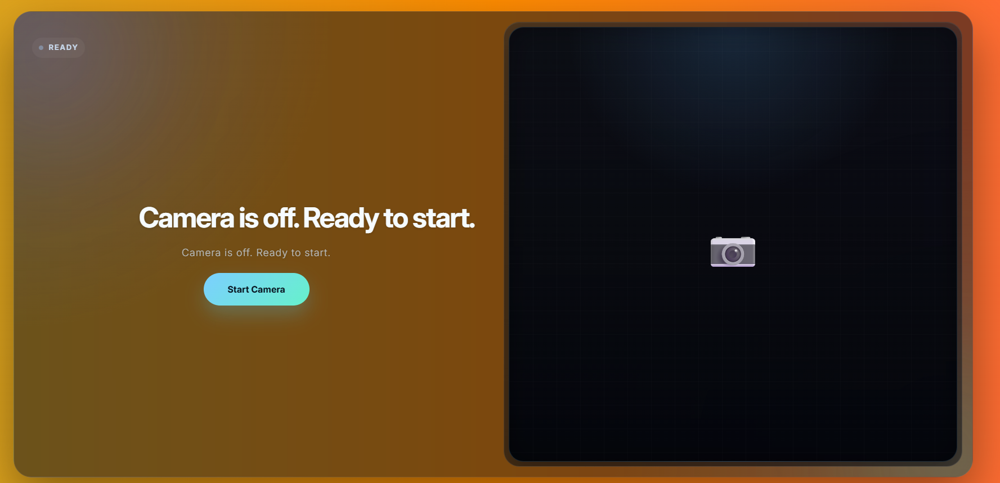
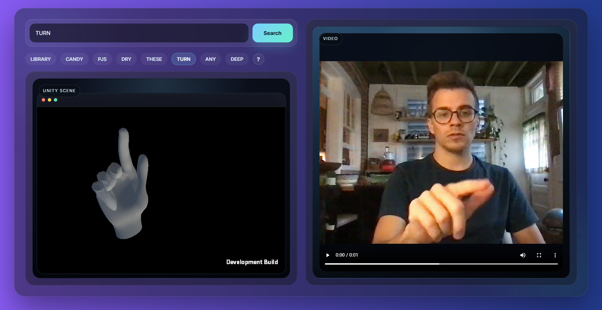

手语翻译与学习平台

一个集成实时手语翻译、3D 手语动作教学及搜索功能的综合性学习平台。本项目旨在通过计算机视觉和 3D 可视化技术，搭建健听人与听障人士之间的沟通桥梁。

🚀 主要功能
1. 实时手语翻译 (Translate Page)

利用摄像头实时捕捉手语动作，并通过自训练模型进行解析。

即时反馈：模型解析后的文本输出。

置信展示：提供识别置信度（Confidence）。

2. 手语教学中心 (Learning Page)

一个海量的手语动作库，支持精准搜索和日常学习。

资源丰富：提供相关手语教学视频及高精度 3D 放大模型。

交互式 3D 视角：

Alt + 鼠标左键：旋转 3D 视角，全方位观察动作细节。

鼠标中键：平移视角，灵活调整观察位置。

3. 联系我们 (Contact Page)

了解团队背景，获取更多项目信息。我们期待与开发者、教育者及手语爱好者的进一步交流与合作。

🛠 使用说明
翻译功能使用流程

进入 Translate Page。

授权开启摄像头。

在镜头前做出手语动作，系统将实时显示翻译文本及置信度。

注意：光照、背景复杂度以及人物在镜头中的比例大小等因素都会影响识别结果，请尽量在光线明亮、背景干净的环境下使用。

学习功能使用流程

进入 Learning Page。

在搜索框输入你想学习的词汇。

点击搜索结果，通过视频和 3D 模型进行临摹学习。

使用快捷键（Alt+左键/中键）调整 3D 模型至最佳观察角度。

⚙️ 部署与运行指南

本项目分为前端（React）和后端（Python/Flask），请按照以下步骤进行本地部署：

1. 获取代码

将本开源仓库克隆或下载到本地：


```Bash
git clone https://github.com/so-why-pikachu/ASL_eye.git
```
2. 配置环境

后端环境 (Backend)
根目录下的 requirements.txt 包含了模型运行最核心的依赖。后端接口基于 Flask 运行，部分额外包需自行安装：


```Bash
# 推荐使用 conda 或 venv 创建虚拟环境
pip install -r requirements.txt
pip install flask flask-cors  # 根据实际需要补充其他缺失的后端依赖
```

前端环境 (Frontend)
前端是一个完整的 React 项目，进入 frontend 目录并安装依赖：


```Bash
cd frontend
npm install  # 或使用 yarn install
```
3. 运行项目

启动后端服务
进入 backend 目录，运行主程序。配置文件 config.py 中均为相对路径，可根据你的本地目录结构按需修改和放置：


```Bash
cd backend
python app.py
```
启动前端服务
进入 frontend 目录，启动开发服务器，或打包后运行：


```Bash
cd frontend
npm run dev   # 开发模式运行
# 或
npm run build # 生产环境打包（打包后可通过静态服务器开放端口运行）
```
4. 关键模型与 WebGL 资源获取 ⚠️

由于 GitHub/Gitee 的存储限制及版权保护，部分核心文件未包含在开源仓库中：

Unity WebGL 构建源码（用于 3D 模型展示交互）

.ckpt 模型权重文件（用于手语识别的核心 AI 权重）

📩 获取方式：请发送邮件至 1784927167@qq.com 获取上述缺失代码及权重文件。获取后请将其放置在 config.py 所指定的相对路径中即可。

📸 界面预览
翻译页面	学习页面


	


⌨️ 快捷键指南 (3D 模型交互)
动作	快捷键	描述
旋转	Alt + 鼠标左键	360度旋转观察手势细节
平移	鼠标中键	移动 3D 模型在屏幕中的位置

联系我们： 欢迎通过平台内的 Contact Page 或发送邮件提交反馈与建议！
